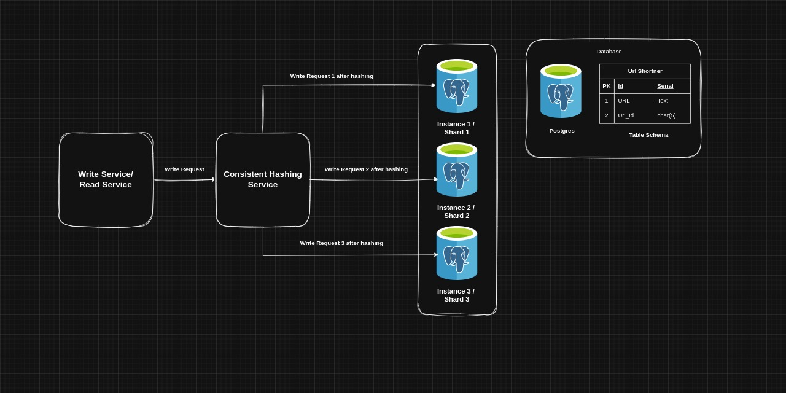
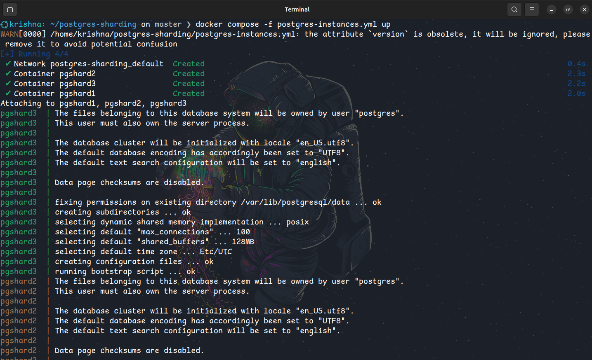
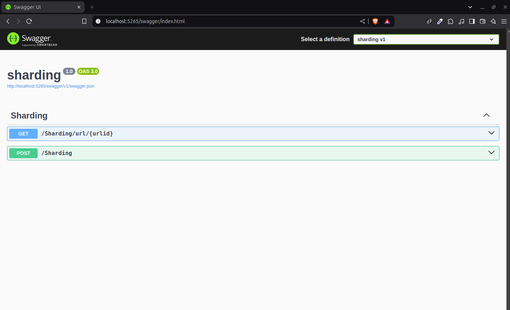

# Sharding Implementation Using Postgres

Implementation of concept sharding using Postgres and using consistent hashing mechanism to route request based on hash of given key/url to their respective postgres database instance


## Run Locally

Clone the project

```bash
  git clone https://link-to-project
```

Go to the project directory

```bash
  cd postgres-sharding
```

Run Docker Compose File

```bash
  docker compose -f postgres-instances.yml up
```

Go to the WEB API project directory

```bash
  cd sharding
```

Build The Project

```bash
  dotnet clean
  dotnet build
```

Run API Project

```bash
  dotnet run
```

## Screenshots






## Authors

- [Krishna Sonune](https://in.linkedin.com/in/krishna-sonune-1421b21b5)


